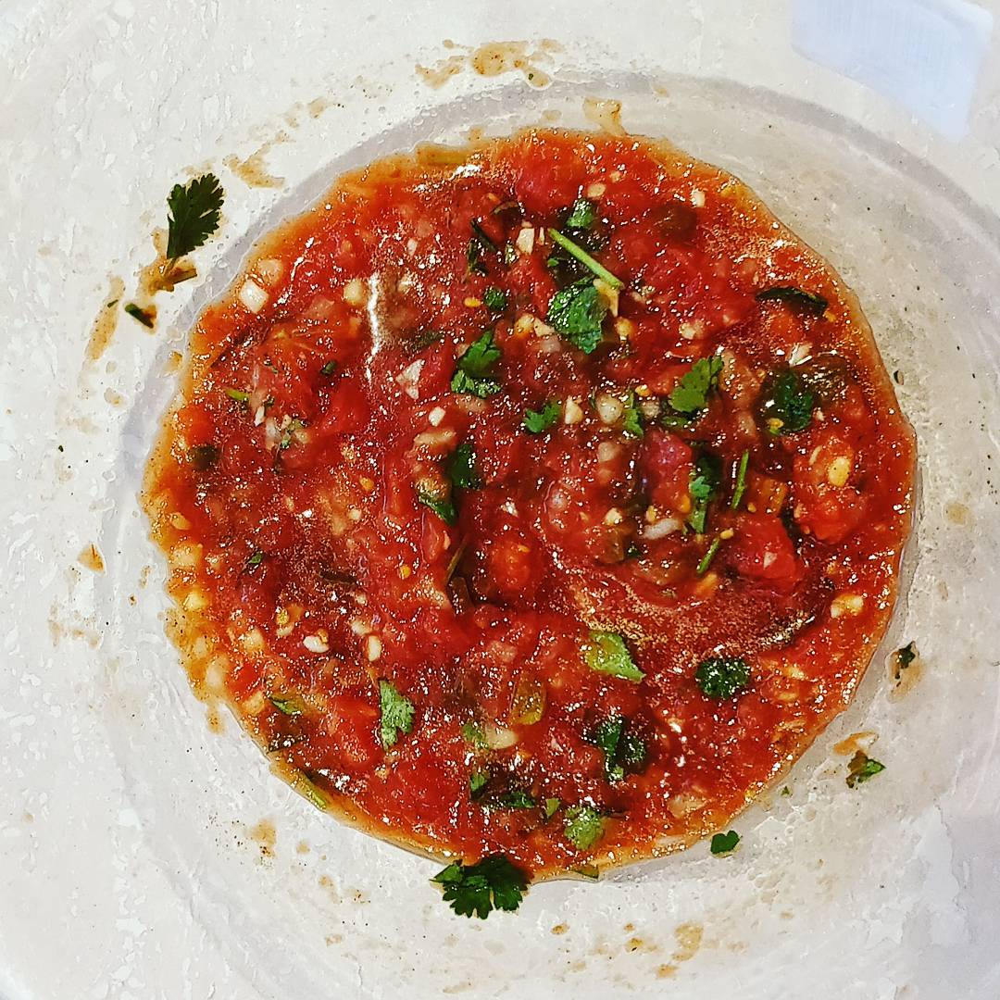

# James' Salsa

_Make some [tortilla chips] to go with!_

## Ingredients

* Tin of peeled plum tomatoes
* Fist of fresh coriander
* Half a brown onion
* Half a garlic bulb
* Half to two thirds of a Jalapeño
* Two tablespoons of Olive Oil
* Two shakes of black pepper
* Pinch of salt

## Guide

1. Chop everything choppable
2. Mix it all together in a bowl
3. Eat delicious salsa

[tortilla chips]: ./leftover-tortilla-chips.md
