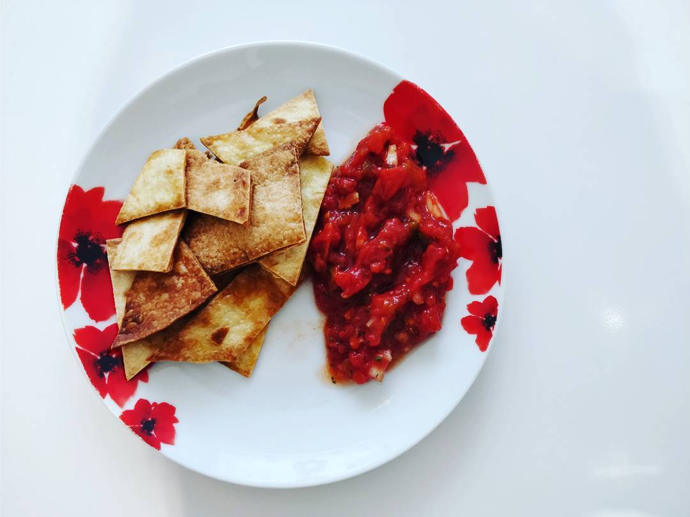

# Leftover Tortillas make good Chips

_Goes great with [James' Salsa]_

## Preparation

* Preheat the oven to 200&#8451;
* Put greaseproof paper on a large oven tray

## Ingredients

* Olive Oil
* Leftover Tortillas

## Guide

* Cut the tortillas into rough triangle shapes
* Put triangles into a large bowl
* Add 2 tablespoons of Olive Oil to bowl
* Mix oil and tortilla triangles gently with hands
* Once coated, lay triangles flat on oven tray; making sure there is space between each one
* _Watch_ them cook for 5 minutes (they can burn quickly)
* Take out
* Cool
* Eat

[James' Salsa]: ./james-salsa.md
